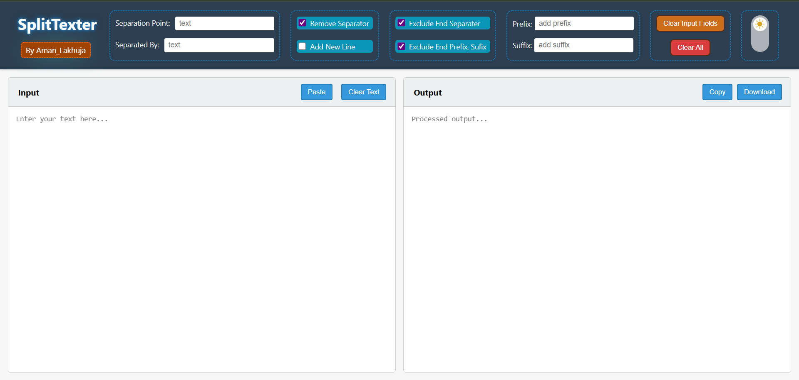
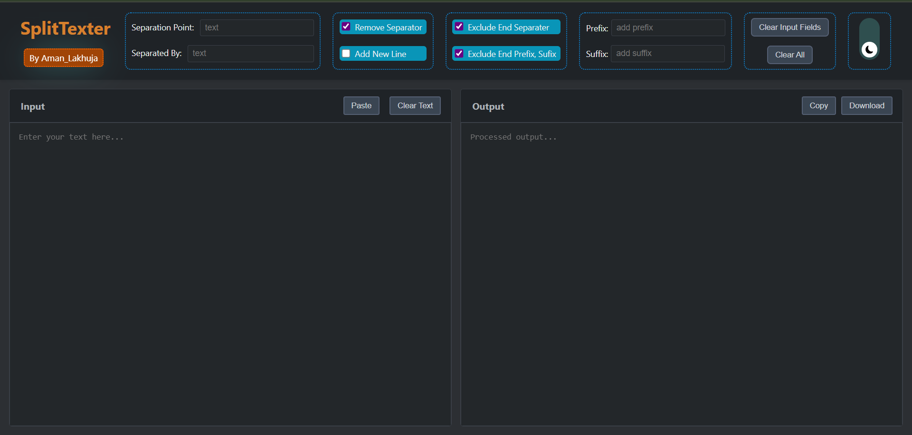

# SplitTexter  

This project is a simple web application that processes text based on user-defined rules. It's built with vanilla HTML, CSS, and JavaScript, requiring no external libraries or frameworks. It allows for user to separate text based on there specified criteria and add prefix and suffix to each Separation Point.

---
## Screenshots 📸




---

## Features ✨
* **Text Formatting :** Split text at a specific point.

* **Insert Custom  Seperator :** It provides option to add a custom seperator value at each seperation point.

* **Insert Prefix and Suffix :** It provides option to add a new line at each seperation point.

* **Insert New Line :** It provides option to add a prifix and suffix at each seperation point.

* **Live Updates:** See the processed output in real-time as you type or change settings.
* **Text Management:** Easily copy the output, download it as a `.txt` file, or clear the text fields with a single click.
* **Dark Mode Toggle:** Enhance your viewing experience with a dark mode feature, controlled by a simple, vertically-oriented toggle button.
* **Light Wight :** It has is super light wight and super responsive.

---

## How to Use 


#### **First Method :-**

1. **Use this Tool Directly From My Github Pages :-**  https://amanlakhuja.github.io/SplitTexter/
        

#### **Second Method :-**

1.  **Clone the repository** to your local machine:

    ```bash
    git clone https://github.com/AmanLakhuja/SplitTexter.git
    ```
2.  **Open `index.html`** in your web browser.


No installation or build process is required. You can start using the application immediately.


---

## Technologies Used 
* **HTML5:** For the page structure and form elements.
* **CSS3:** For all styling, including the dark mode theme and toggle button animations.
* **JavaScript (ES6):** For all the text processing logic and event handling.

***

## Project Structure 📂


```bash
SplitTexter
│
├── index.html       # The main HTML file
├── style.css        # The CSS for all styling
├── script.js        # The JavaScript for functionality
└── /images/         # Folder containing image assets
    ├── SplitTexter_dark.png
    └── SplitTexter_light.png
```

---

# **License**

This project is licensed under the **Server Side Public License (SSPL) v1**.

Copyright (C) [Aman Lakhuja] [2025]

This program is licensed under the Server Side Public License, version 1,
as published by MongoDB, Inc.

You may obtain a copy of the SSPL at
https://www.mongodb.com/licensing/server-side-public-license
*/


## Dependencies

This project has **no external dependencies**.  

It is built using only **HTML, CSS, and JavaScript** — no frameworks, libraries, or package managers required.

---

## Project Links

* **Github Page Hosting :-** https://amanlakhuja.github.io/SplitTexter/

* **Github Repository :-** https://github.com/AmanLakhuja/SplitTexter
